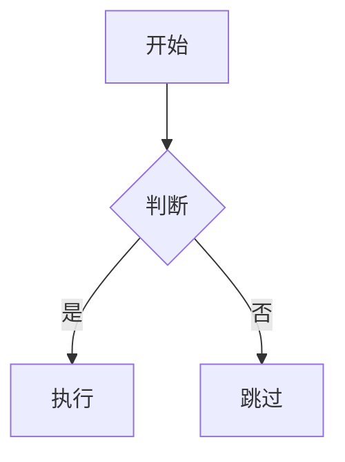

# Mintlify 开发参考手册

> 面向内容编写的实用指南 — 配置、页面、组件、API 文档的完整语法参考。

---

## 目录

- [1. 项目结构](#1-项目结构)
- [2. 核心配置 (docs.json)](#2-核心配置-docsjson)
  - [2.1 必填字段](#21-必填字段)
  - [2.2 外观与品牌](#22-外观与品牌)
  - [2.3 导航结构](#23-导航结构)
  - [2.4 Navbar / Footer / Banner](#24-navbar--footer--banner)
  - [2.5 SEO 与搜索](#25-seo-与搜索)
  - [2.6 API 设置](#26-api-设置)
  - [2.7 第三方集成](#27-第三方集成)
  - [2.8 变量与重定向](#28-变量与重定向)
  - [2.9 样式细节](#29-样式细节)
- [3. 页面编写 (MDX)](#3-页面编写-mdx)
  - [3.1 Frontmatter 属性](#31-frontmatter-属性)
  - [3.2 页面模式](#32-页面模式)
  - [3.3 文本格式](#33-文本格式)
  - [3.4 代码块](#34-代码块)
  - [3.5 图片与嵌入](#35-图片与嵌入)
  - [3.6 列表与表格](#36-列表与表格)
  - [3.7 可复用片段 (Snippets)](#37-可复用片段-snippets)
  - [3.8 Changelog (更新日志)](#38-changelog-更新日志)
- [4. 组件库](#4-组件库)
  - [4.1 内容结构组件](#41-内容结构组件)
  - [4.2 注意力组件](#42-注意力组件)
  - [4.3 渐进展示组件](#43-渐进展示组件)
  - [4.4 API 文档组件](#44-api-文档组件)
  - [4.5 导航与视觉组件](#45-导航与视觉组件)
  - [4.6 AI 提示组件](#46-ai-提示组件)
- [5. API Playground](#5-api-playground)
  - [5.1 OpenAPI 自动生成](#51-openapi-自动生成)
  - [5.2 MDX 手动创建端点页面](#52-mdx-手动创建端点页面)
  - [5.3 x-mint 扩展](#53-x-mint-扩展)
- [6. 主题系统](#6-主题系统)
- [7. 自定义样式](#7-自定义样式)
  - [7.1 自定义字体](#71-自定义字体)
  - [7.2 React 组件](#72-react-组件)
  - [7.3 自定义 CSS / JS](#73-自定义-css--js)
- [8. 国际化 (i18n)](#8-国际化-i18n)
- [9. 隐藏页面与 .mintignore](#9-隐藏页面与-mintignore)
- [10. 静态文件](#10-静态文件)
- [附录: 图标使用指南](#附录-图标使用指南)
- [附录: CLI 常用命令](#附录-cli-常用命令)

---

## 1. 项目结构

```
docs/
├── docs.json              # 核心配置文件（必须）
├── index.mdx              # 首页
├── quickstart.mdx         # 快速开始
├── favicon.svg            # 站点图标
├── global.css             # 全局自定义样式（可选）
├── .mintignore            # 排除文件（可选）
├── images/                # 图片资源
├── logo/                  # Logo 文件
│   ├── light.svg
│   └── dark.svg
├── snippets/              # 可复用片段（不会渲染为独立页面）
│   └── common-note.mdx
├── api-reference/         # API 文档
│   └── introduction.mdx
├── guides/                # 指南文档
│   └── getting-started.mdx
├── zh/                    # 中文翻译（与根目录结构一致）
│   ├── index.mdx
│   └── quickstart.mdx
└── .mintlify/             # Mintlify 特殊配置
    └── Assistant.md       # AI 助手自定义指令
```

---

## 2. 核心配置 (docs.json)

### 2.1 必填字段

```json
{
  "$schema": "https://mintlify.com/docs.json",
  "theme": "mint",
  "name": "My Project",
  "colors": {
    "primary": "#16A34A"
  },
  "navigation": {
    "groups": [
      {
        "group": "Getting Started",
        "pages": ["index", "quickstart"]
      }
    ]
  }
}
```

| 字段 | 类型 | 说明 |
|------|------|------|
| `theme` | string | 布局主题：mint / maple / palm / willow / linden / almond / aspen / sequoia / luma |
| `name` | string | 项目名称 |
| `colors.primary` | hex | 主品牌色（浅色模式强调色） |
| `navigation` | object | 站点内容组织结构 |

### 2.2 外观与品牌

#### 颜色

```json
{
  "colors": {
    "primary": "#16A34A",
    "light": "#07C983",
    "dark": "#15803D"
  }
}
```

- `primary`: 浅色模式强调色
- `light`: 深色模式强调色
- `dark`: 按钮和悬停状态

#### Logo

```json
// 单一图片
"logo": "/logo/logo.svg"

// 深浅色分开 + 点击链接
"logo": {
  "light": "/logo/light.svg",
  "dark": "/logo/dark.svg",
  "href": "https://example.com"
}
```

#### Favicon

```json
"favicon": "/favicon.svg"

// 或深浅色分开
"favicon": { "light": "/favicon-light.svg", "dark": "/favicon-dark.svg" }
```

#### 外观模式

```json
{
  "appearance": {
    "default": "system",   // "system" | "light" | "dark"
    "strict": false         // true 隐藏主题切换按钮
  }
}
```

#### 字体

```json
{
  "fonts": {
    "heading": { "family": "Inter", "weight": 700 },
    "body": {
      "family": "Roboto",
      "source": "/fonts/Roboto.woff2",
      "format": "woff2",
      "weight": 400
    }
  }
}
```

- **Google Fonts**: 仅需 `family`，自动加载
- **自托管**: 需要 `source` (路径/URL) + `format` (woff/woff2)

#### 图标库

```json
{ "icons": { "library": "lucide" } }
```

可选：`"fontawesome"` | `"lucide"` | `"tabler"`

#### 背景

```json
{
  "background": {
    "decoration": "gradient",   // "gradient" | "grid" | "windows"
    "color": { "light": "#F5F5F5", "dark": "#1A1A1A" },
    "image": { "light": "/images/bg-light.png", "dark": "/images/bg-dark.png" }
  }
}
```

### 2.3 导航结构

Mintlify 的导航系统支持多种元素嵌套组合。

#### Pages — 最基本单元

引用 MDX 文件路径（不含扩展名）：

```json
"pages": ["index", "quickstart", "guides/getting-started"]
```

#### Groups — 侧边栏分节

```json
{
  "group": "Getting Started",
  "icon": "rocket",
  "tag": "NEW",
  "pages": ["index", "quickstart"],
  "expanded": true
}
```

| 属性 | 必填 | 说明 |
|------|------|------|
| `group` | 是 | 分节标签 |
| `pages` | 是 | 子页面或子分组 |
| `icon` | 否 | 图标 |
| `tag` | 否 | 徽章（如 "NEW"） |
| `root` | 否 | 分组主页面 |
| `expanded` | 否 | 默认展开/收起（顶级分组始终展开） |

#### Tabs — 水平标签栏

```json
{
  "navigation": {
    "tabs": [
      { "tab": "Guides", "groups": [...] },
      { "tab": "API Reference", "icon": "code", "groups": [...] }
    ]
  }
}
```

#### Menus — 标签内下拉菜单

```json
{ "item": "Resources", "icon": "book", "description": "帮助资源", "pages": [...] }
```

#### Anchors — 侧边栏持久链接

```json
{
  "navigation": {
    "global": {
      "anchors": [
        { "anchor": "Blog", "href": "https://blog.example.com", "icon": "newspaper" }
      ]
    }
  }
}
```

全局锚点在所有页面显示。

#### Products — 产品切换器

```json
{
  "navigation": {
    "products": [
      { "product": "Platform", "icon": "server", "tabs": [...] },
      { "product": "SDK", "icon": "code", "tabs": [...] }
    ]
  }
}
```

#### Dropdowns — 侧边栏顶部下拉

```json
{ "dropdown": "Resources", "icon": "book", "groups": [...] }
```

#### Versions — 版本切换

```json
{
  "navigation": {
    "versions": [
      { "version": "v2", "default": true, "tag": "Latest", "tabs": [...] },
      { "version": "v1", "tag": "Deprecated", "tabs": [...] }
    ]
  }
}
```

#### Languages — 多语言

```json
{
  "navigation": {
    "languages": [
      { "language": "en", "default": true, "tabs": [...] },
      { "language": "zh", "tabs": [...] }
    ]
  }
}
```

#### OpenAPI 导航集成

```json
{
  "tab": "API Reference",
  "openapi": "openapi.json",
  "groups": [
    { "group": "Users", "pages": ["GET /users", "POST /users"] }
  ]
}
```

不指定 `pages` 时自动生成所有端点页面。子元素继承父级 OpenAPI 规范。

#### 交互控制

```json
{
  "styling": { "eyebrows": "breadcrumbs" },  // "breadcrumbs" | "section"
  "interaction": { "drilldown": true }         // 点击分组自动导航到首页
}
```

#### 嵌套规则

- 必须有一个根级父元素（tabs / groups / dropdown）
- 每层只能包含一种类型子元素
- 有效嵌套：Tabs→Groups/Menus, Products→Tabs/Groups, Versions→Tabs/Groups

### 2.4 Navbar / Footer / Banner

#### Navbar

```json
{
  "navbar": {
    "links": [
      { "label": "Blog", "href": "https://blog.example.com" },
      { "type": "github", "href": "https://github.com/org/repo" },
      { "type": "discord", "href": "https://discord.gg/xxx" }
    ],
    "primary": { "type": "button", "label": "Get Started", "href": "https://app.example.com" }
  }
}
```

`type: "github"` 自动显示 star 数，`type: "discord"` 显示在线用户。

#### Footer

```json
{
  "footer": {
    "socials": {
      "x": "https://x.com/example",
      "github": "https://github.com/example",
      "discord": "https://discord.gg/xxx"
    },
    "links": [
      {
        "header": "Resources",
        "items": [
          { "label": "Blog", "href": "https://blog.example.com" }
        ]
      }
    ]
  }
}
```

支持平台：x, website, facebook, youtube, discord, slack, github, linkedin, instagram, bluesky, threads, reddit 等。

#### Banner

```json
{
  "banner": {
    "content": "**v2.0** is now available! [Read more](/changelog)",
    "dismissible": true
  }
}
```

支持基本 MDX 格式（链接、加粗、斜体）。颜色取 `colors.dark`。可按语言配置不同 banner。

### 2.5 SEO 与搜索

```json
{
  "description": "Documentation for Example API.",
  "seo": {
    "indexing": "navigable",           // "navigable" | "all"
    "metatags": {
      "og:site_name": "Example Docs",
      "twitter:card": "summary_large_image"
    }
  },
  "search": { "prompt": "Search the docs..." },
  "metadata": { "timestamp": true }
}
```

### 2.6 API 设置

```json
{
  "api": {
    "openapi": "openapi.json",
    "playground": {
      "display": "interactive",        // "interactive" | "simple" | "none" | "auth"
      "proxy": true
    },
    "params": { "expanded": "all" },   // "all" | "closed"
    "url": "full",
    "examples": {
      "languages": ["curl", "python", "javascript", "go"],
      "defaults": "required",           // "required" | "all"
      "prefill": true,
      "autogenerate": true
    },
    "spec": { "download": true },
    "mdx": {
      "auth": { "method": "bearer", "name": "Authorization" },
      "server": "https://api.example.com/v1"
    }
  }
}
```

**OpenAPI 格式选项：**
- 单文件: `"openapi.json"`
- 多文件: `["openapi/v1.json", "openapi/v2.json"]`
- 目录对象: `{ "source": "openapi.json", "directory": "api-reference" }`

**代码示例语言：** bash, python, javascript, node, php, go, java, ruby, powershell, swift, csharp, dotnet, typescript, c, cpp, kotlin, rust, dart

### 2.7 第三方集成

```json
{
  "integrations": {
    "ga4": { "measurementId": "G-XXXXXXXX" },
    "posthog": { "apiKey": "phc_xxx", "apiHost": "https://app.posthog.com" },
    "intercom": { "appId": "xxxxxx" },
    "telemetry": { "enabled": true }
  }
}
```

支持平台一览：

| 类别 | 平台 |
|------|------|
| 分析 | GA4, GTM, Amplitude, Mixpanel, PostHog, Segment, Heap, Hightouch, Adobe |
| 会话录制 | LogRocket, Hotjar, Clarity |
| 隐私分析 | Plausible, Fathom, Pirsch |
| 聊天/支持 | Intercom, Front |
| 数据增强 | Clearbit |

### 2.8 变量与重定向

#### 变量

```json
{ "variables": { "appName": "MyApp", "apiVersion": "v2" } }
```

在 MDX 中使用 `{{appName}}`。名称只能包含字母、数字、连字符、点号。

#### 重定向

```json
{
  "redirects": [
    { "source": "/old-page", "destination": "/new-page" },
    { "source": "/temp", "destination": "/other", "permanent": false },
    { "source": "/beta/:slug*", "destination": "/v2/:slug*" }
  ]
}
```

- 默认 308 永久重定向；`"permanent": false` 为 307 临时重定向
- 支持 `*` 通配符
- 不能包含 `#anchor` 或查询参数

#### 404 页面

```json
{
  "errors": {
    "404": {
      "redirect": false,
      "title": "页面未找到",
      "description": "抱歉，您访问的页面不存在。[返回首页](/)"
    }
  }
}
```

`description` 支持 MDX 格式。系统自动推荐语义相关页面。

### 2.9 样式细节

```json
{
  "styling": {
    "eyebrows": "breadcrumbs",    // "breadcrumbs" | "section"
    "latex": true,
    "codeblocks": {
      "light": "github-light",
      "dark": "github-dark"
    }
  }
}
```

代码块主题选项：`"system"` | `"dark"` | 任何 Shiki 主题名 | `{ "light": "...", "dark": "..." }`

支持通过自定义 TextMate 语法 JSON 添加语言高亮。

#### Contextual Menu（上下文菜单）

```json
{
  "contextual": {
    "display": "header",              // "header" | "toc"
    "options": [
      "copy", "view", "assistant", "chatgpt", "claude",
      "perplexity", "cursor", "vscode", "mcp",
      {
        "title": "Feature Request",
        "description": "Submit a request",
        "icon": "lightbulb",
        "href": "https://github.com/org/repo/issues/new?title=$page"
      }
    ]
  }
}
```

预置选项：copy, view, assistant, chatgpt, claude, perplexity, grok, aistudio, devin, windsurf, cursor, vscode, mcp, add-mcp, devin-mcp

自定义 href 占位符：`$page`（页面内容）, `$path`（路径）, `$mcp`（MCP URL）

---

## 3. 页面编写 (MDX)

### 3.1 Frontmatter 属性

```yaml
---
title: "页面标题"
description: "页面描述，用于 SEO"
sidebarTitle: "侧边栏简称"
icon: "rocket"
iconType: "solid"
tag: "Beta"
hidden: true
noindex: true
deprecated: true
groups: ["admin", "developer"]
mode: "wide"
timestamp: true
keywords: ["搜索", "关键词"]
openapi: "openapi.json GET /users"
url: "https://external-link.com"
---
```

| 属性 | 类型 | 说明 |
|------|------|------|
| `title` | string | 导航和浏览器标签标题，省略时从文件路径自动生成 |
| `description` | string | 页面概述，显示在标题下方，提升 SEO |
| `sidebarTitle` | string | 侧边栏中的缩写标签 |
| `icon` | string | Font Awesome / Lucide / Tabler 名称、URL 或文件路径 |
| `iconType` | string | FA 样式: regular / solid / light / thin / sharp-solid / duotone / brands |
| `tag` | string | 标题旁徽章 |
| `hidden` | boolean | 从导航隐藏但保留 URL |
| `noindex` | boolean | 阻止搜索引擎索引 |
| `deprecated` | boolean | 显示弃用标签 |
| `groups` | string[] | 限制对认证分组可见 |
| `mode` | string | 页面布局模式（见 3.2） |
| `timestamp` | boolean | 覆盖全局时间戳设置 |
| `keywords` | string[] | 不可见的搜索关键词 |
| `openapi` | string | 关联 OpenAPI 端点 |
| `url` | string | 链接到外部网站 |
| 自定义属性 | any | 任何有效 YAML |

### 3.2 页面模式

| 模式 | 说明 | 限制 |
|------|------|------|
| **default** | 侧边栏 + 目录 | — |
| **wide** | 隐藏目录，加宽内容 | — |
| **custom** | 仅保留顶部导航栏 | — |
| **frame** | custom + 保留侧边栏 | 仅 Aspen / Almond / Luma |
| **center** | 内容居中，无侧边栏和目录 | 仅 Mint / Linden |

### 3.3 文本格式

```markdown
## 标题（自动生成锚点）
### 子标题

**加粗** _斜体_ ~删除线~
**_加粗斜体_** **~加粗删除线~**
<sup>上标</sup> <sub>下标</sub>

[内部链接](/path/to/page)
[外部链接](https://example.com)

> 引用块
>
> 多段落引用

行内数学: $E = mc^2$

块级公式:
$$
\int_0^\infty e^{-x^2} dx = \frac{\sqrt{\pi}}{2}
$$

空行 = 段落分隔。<br /> = 强制换行。
```

### 3.4 代码块

#### 基本语法

````markdown
`行内代码`

```python
def hello():
    print("Hello, world!")
```
````

#### Meta 选项

````markdown
```javascript title="example.js" icon="code" lines
const greeting = "Hello";
```

```typescript highlight={1-3,5}
const a = 1;   // 高亮
const b = 2;   // 高亮
const c = 3;   // 高亮
const d = 4;
const e = 5;   // 高亮
```

```python focus={2,4-5}
import os
import sys       # 聚焦
import json
import yaml      # 聚焦
import toml      # 聚焦
```

```javascript expandable
// 长代码可折叠展开
```

```bash wrap
# 长命令自动换行
```
````

| 选项 | 说明 |
|------|------|
| `lines` | 显示行号 |
| `title="..."` | 标题标签 |
| `icon="..."` | 图标标签 |
| `highlight={1-3,5}` | 高亮指定行 |
| `focus={2,4-5}` | 聚焦指定行 |
| `expandable` | 可折叠 |
| `wrap` | 文本换行 |

#### Diff 语法

```javascript
const old = "removed"; // [!code --]
const new = "added";   // [!code ++]

// 多行 diff
const a = 1; // [!code ++:3]
const b = 2;
const c = 3;
```

注释格式按语言：JS/TS/Java `//`，Python/Bash `#`

#### Twoslash

JS/TS 代码块加 `twoslash`，悬停变量可查看类型信息。

### 3.5 图片与嵌入

#### 图片

```markdown

```

- 上限 20 MB，大文件用 CDN 托管
- HTML `` 可自定义尺寸样式
- `noZoom` 禁用点击放大
- 深浅色切换：`block dark:hidden` / `hidden dark:block`

#### 视频

```html
<!-- YouTube -->
<iframe src="https://www.youtube.com/embed/VIDEO_ID" />

<!-- 自托管 -->
<video src="/videos/demo.mp4" controls />

<!-- 自动播放（注意 JSX 驼峰属性） -->
<video autoPlay muted loop playsInline src="/videos/bg.mp4" />
```

#### iframe

```html
<iframe src="https://example.com" className="w-full aspect-video rounded-xl" />
```

### 3.6 列表与表格

```markdown
1. 有序列表
2. 第二项

- 无序列表
  - 嵌套项

| 左对齐 | 居中 | 右对齐 |
| :--- | :---: | ---: |
| 内容 | 内容 | 内容 |
```

### 3.7 可复用片段 (Snippets)

`/snippets/` 目录中的文件不渲染为页面，仅在导入位置展示。

#### 基本导入

```mdx
import MySnippet from '/snippets/my-snippet.mdx';
<MySnippet />

// 相对导入（支持 CMD+Click 跳转）
import Note from '../snippets/note.mdx';
<Note />
```

#### 变量导出

```mdx
// snippets/config.mdx
export const apiUrl = "https://api.example.com";
```

```mdx
// 使用
import { apiUrl } from '/snippets/config.mdx';
Base URL: {apiUrl}
```

#### 参数化片段

```mdx
// snippets/endpoint.mdx
The {props.method} endpoint at `{props.path}` returns {props.description}.
```

```mdx
import Endpoint from '/snippets/endpoint.mdx';
<Endpoint method="GET" path="/users" description="a list of users" />
```

#### React 组件片段

放在 `/snippets/` 中，**必须使用箭头函数**，不支持嵌套导入（所有组件必须在父 MDX 中直接导入）。

### 3.8 Changelog (更新日志)

```mdx
---
title: "Changelog"
---

<Update label="March 2024" description="v2.0.0" tags={["feature", "improvement"]}>
## New Dashboard
Added a redesigned dashboard.
</Update>

<Update label="February 2024" description="v1.9.0" tags={["bugfix"]}>
## Bug Fixes
Fixed API rate limiting issue.
</Update>
```

- 每个 `label` 自动生成侧边栏导航
- `tags` 启用标签过滤
- 公开站点自动生成 RSS (`/rss.xml`)
- frontmatter `rss: true` 显示 RSS 图标
- RSS 仅含 Markdown，组件被排除，用 `rss` prop 提供替代描述

---

## 4. 组件库

### 4.1 内容结构组件

#### Tabs

```mdx
<Tabs defaultTabIndex={0} sync={true} borderBottom>
  <Tab title="JavaScript" icon="js">
    ```javascript
    console.log("Hello");
    ```
  </Tab>
  <Tab title="Python" icon="python">
    ```python
    print("Hello")
    ```
  </Tab>
</Tabs>
```

| Tabs 属性 | 默认 | 说明 |
|-----------|------|------|
| `defaultTabIndex` | 0 | 默认标签索引 |
| `sync` | true | 同名标签跨页面同步 |
| `borderBottom` | — | 底部边框 |

Tab 属性：`title`（必填）, `id`, `icon`, `iconType`

#### CodeGroup

```mdx
<CodeGroup>
```javascript index.js
console.log("Hello");
```

```python main.py
print("Hello")
```
</CodeGroup>
```

自动与同页面 Tabs 同步。支持 `dropdown` prop 切换为下拉菜单。

#### Steps

```mdx
<Steps titleSize="h3">
  <Step title="安装" icon="download">
    ```bash
    npm install my-package
    ```
  </Step>
  <Step title="配置" icon="gear">
    创建配置文件。
  </Step>
  <Step title="运行" icon="play">
    ```bash
    npm start
    ```
  </Step>
</Steps>
```

Steps：`titleSize`（p / h2 / h3 / h4，默认 p）

Step：`title`（必填）, `icon`, `iconType`, `stepNumber`, `id`, `noAnchor`

#### Columns

```mdx
<Columns cols={3}>
  <Card title="A" icon="star" href="/a">描述</Card>
  <Card title="B" icon="heart" href="/b">描述</Card>
  <Card title="C" icon="bolt" href="/c">描述</Card>
</Columns>

<!-- 自由内容列 -->
<Columns cols={2}>
  <Column>左侧内容</Column>
  <Column>右侧内容</Column>
</Columns>
```

`cols`：1-4，默认 2，自动响应式。

#### Panel

替换右侧目录区域为自定义内容：

```mdx
<Panel>
  <Info>固定在侧面板的信息。</Info>
</Panel>
```

> RequestExample / ResponseExample 必须放在 Panel 内。

### 4.2 注意力组件

#### Callout（6 种内置 + 自定义）

```mdx
<Note>提示信息</Note>
<Warning>警告信息</Warning>
<Info>重要信息</Info>
<Tip>小贴士</Tip>
<Check>成功状态</Check>
<Danger>危险操作</Danger>

<!-- 自定义 -->
<Callout icon="lightbulb" color="#FFC107">
  自定义颜色和图标的提示框
</Callout>
```

#### Badge

```mdx
<Badge color="green" size="md">Active</Badge>
<Badge color="red" size="sm" shape="pill">Deprecated</Badge>
<Badge color="blue" icon="star" stroke>Premium</Badge>
<Badge color="gray" disabled>Unavailable</Badge>
```

颜色：gray / blue / green / yellow / orange / red / purple / white / surface / white-destructive / surface-destructive

尺寸：xs / sm / md / lg。形状：rounded（默认）/ pill

#### Frame

```mdx
<Frame caption="说明文字，支持 [Markdown](/page)" hint="上方提示">
  
</Frame>

<Frame>
  <video autoPlay src="/videos/demo.mp4" />
</Frame>
```

视频带 `autoPlay` 时自动添加 `playsInline`, `loop`, `muted`。

#### Tooltip

```mdx
使用 <Tooltip tip="Application Programming Interface" headline="API" cta="阅读指南" href="/api-guide">API</Tooltip> 进行开发。
```

`tip`（必填）, `headline`, `cta`, `href`（使用 cta 时必填）

### 4.3 渐进展示组件

#### Accordion

```mdx
<AccordionGroup>
  <Accordion title="问题一" icon="circle-question" defaultOpen>
    答案一，支持代码块和其他组件。
  </Accordion>
  <Accordion title="问题二" description="可选副标题" id="custom-anchor">
    答案二
  </Accordion>
</AccordionGroup>
```

`title`（必填）, `description`, `defaultOpen`, `id`, `icon`, `iconType`

打开时更新 URL hash，可分享链接到特定部分。

#### Expandable

用于 API 文档展示嵌套对象：

```mdx
<ResponseField name="user" type="User Object">
  <Expandable title="properties" defaultOpen={false}>
    <ResponseField name="full_name" type="string">用户全名</ResponseField>
    <ResponseField name="email" type="string">邮箱</ResponseField>
  </Expandable>
</ResponseField>
```

#### View

基于选择的语言/框架动态切换内容，自动更新目录：

```mdx
<View title="JavaScript" icon="js">
  ## JS 安装
  ```bash
  npm install my-package
  ```
</View>

<View title="Python" icon="python">
  ## Python 安装
  ```bash
  pip install my-package
  ```
</View>
```

### 4.4 API 文档组件

#### ParamField

```mdx
<ParamField path="userId" type="string" required>用户 ID</ParamField>
<ParamField body="email" type="string" required>用户邮箱</ParamField>
<ParamField query="limit" type="number" default="20">返回数量上限</ParamField>
<ParamField header="x-api-key" type="string" required>API 密钥</ParamField>
```

位置：`query` / `path` / `body` / `header`

添加 ParamField **自动生成 API Playground**。

#### ResponseField

```mdx
<ResponseField name="id" type="string" required>唯一标识</ResponseField>
<ResponseField name="status" type="string" deprecated>已弃用</ResponseField>
<ResponseField name="tags" type="string[]" pre={["beta"]} post={["v2"]}>标签列表</ResponseField>
```

属性：`name`（必填）, `type`（必填）, `default`, `required`, `deprecated`, `pre`, `post`

#### RequestExample / ResponseExample

```mdx
<RequestExample>
```bash cURL
curl -X POST https://api.example.com/users \
  -H "Authorization: Bearer TOKEN" \
  -d '{"email": "user@example.com"}'
```

```python Python
import requests
response = requests.post(...)
```
</RequestExample>

<ResponseExample>
```json 200
{ "id": "usr_123", "email": "user@example.com" }
```

```json 400
{ "error": "Invalid email" }
```
</ResponseExample>
```

桌面端显示在右侧边栏，移动端为常规滚动块。支持 `dropdown` prop。每个代码块需要 title。

### 4.5 导航与视觉组件

#### Card

```mdx
<Card title="快速开始" icon="rocket" href="/quickstart" horizontal>
  几分钟内完成首次调用。
</Card>

<Card title="功能" img="/images/feature.png" cta="了解更多" arrow>描述</Card>
```

属性：`title`, `icon`, `iconType`, `color`（hex）, `href`, `horizontal`, `img`, `cta`, `arrow`

#### Tile

```mdx
<Columns cols={3}>
  <Tile title="组件 A" description="说明" href="/a">
    
  </Tile>
</Columns>
```

必填：`href`, `children`（图片）。可选：`title`, `description`

#### Icon

```mdx
<Icon icon="flag" iconType="solid" color="#FF5733" size={24} />
```

#### Mermaid

````mdx

````

支持流程图、时序图、甘特图。ELK 布局引擎优化大型图表。内置缩放/平移/重置。

#### Color

```mdx
<Color variant="compact">
  <Color.Item name="Primary" value="#16A34A" />
  <Color.Item name="Dark" value={{ light: "#F5F5F5", dark: "#1A1A1A" }} />
</Color>

<Color variant="table">
  <Color.Row title="品牌色">
    <Color.Item name="绿色" value="#16A34A" />
  </Color.Row>
</Color>
```

格式：Hex, RGB/RGBA, HSL, OKLCH。点击可复制。

#### Tree

```mdx
<Tree>
  <Tree.Folder name="src" defaultOpen>
    <Tree.Folder name="components">
      <Tree.File name="Button.tsx" />
    </Tree.Folder>
    <Tree.File name="index.ts" />
  </Tree.Folder>
  <Tree.File name="package.json" />
</Tree>
```

支持键盘导航（方向键、Home/End、Enter/Space、`*` 展开同级）。

### 4.6 AI 提示组件

#### Prompt

```mdx
<Prompt
  description="**技术文档助手** — 帮助编写准确的技术文档"
  actions={["copy", "cursor"]}
  icon="pen"
>
你是技术文档编写助手，使用主动语态，保持简洁。
</Prompt>
```

必填：`description`, `children`。可选：`actions`（默认仅 copy，可加 cursor）, `icon`, `iconType`

---

## 5. API Playground

### 5.1 OpenAPI 自动生成

Mintlify 从 OpenAPI 3.0/3.1（JSON/YAML）自动生成交互式 API 页面。

**docs.json 配置：**

```json
{
  "api": { "openapi": "openapi.json" },
  "navigation": {
    "tabs": [{
      "tab": "API Reference",
      "openapi": "openapi.json",
      "groups": [
        { "group": "Users", "pages": ["GET /users", "POST /users"] }
      ]
    }]
  }
}
```

**OpenAPI 必需字段：**

```json
{
  "servers": [{ "url": "https://api.example.com/v1" }],
  "components": {
    "securitySchemes": {
      "bearerAuth": { "type": "http", "scheme": "bearer" }
    }
  },
  "security": [{ "bearerAuth": [] }]
}
```

**自动生成页面继承：** title ← summary, description ← description, deprecated ← 自动标签

**限制：** 仅支持单文档内的 `$ref` 内部引用，不支持外部引用。

### 5.1.1 嵌套对象（Nested Object）Playground 踩坑

Mintlify Playground 对请求体中的**嵌套 object 类型字段**序列化存在问题。当 `type: object` 以 inline 方式定义子属性时，Playground 表单无法正确将子字段包装成嵌套 JSON 对象，导致上游 API 报错（如 `The required parameter Filter is missing`）。

**现象：**
- 右侧 curl 示例显示正确的嵌套 JSON
- 但实际发送的请求 body 中嵌套对象为空 `{}` 或完全缺失
- 抓包 `/_mintlify/api/request` 可确认 `body` 字段异常

**解决方案：用 `$ref` 替代 inline schema**

将嵌套对象抽成独立 schema，用 `$ref` 引用。这样 Mintlify 能正确构建 schema tree 并序列化嵌套字段。

```yaml
# ❌ 错误：inline 定义嵌套对象 — Playground 无法正确序列化
properties:
  Filter:
    type: object
    properties:
      Name:
        type: string
      GroupIds:
        type: array
        items:
          type: string

# ✅ 正确：用 $ref 引用独立 schema — Playground 可正常工作
properties:
  Filter:
    $ref: '#/components/schemas/MyFilter'

components:
  schemas:
    MyFilter:
      type: object
      properties:
        Name:
          type: string
          example: "test"
        GroupIds:
          type: array
          items:
            type: string
          example:
            - "group-123"
```

**注意事项：**
- 使用 `$ref` 后，Playground 表单可以正确展开嵌套字段并序列化
- 但 `example` 值**不会自动预填**到表单中，用户必须手动填写才能发送（`default` 同理）
- 如果用户不填写嵌套字段直接点发送，嵌套对象仍可能为空导致 API 报错
- 建议在 Request schema 级别加上完整 `example`（影响右侧 curl 展示），同时在每个子字段也加 `example`（影响表单 placeholder）
- 使用 `required` 标记必填的嵌套字段，Playground 会显示必填提示

**完整模板：**

```yaml
paths:
  /my/endpoint:
    post:
      requestBody:
        required: true
        content:
          application/json:
            schema:
              $ref: '#/components/schemas/MyRequest'
components:
  schemas:
    MyFilter:
      type: object
      properties:
        Name:
          type: string
          example: "test"
    MyRequest:
      type: object
      required:
        - model
        - Filter
      properties:
        model:
          type: string
          example: "my-model"
        Filter:
          $ref: '#/components/schemas/MyFilter'
      example:
        model: "my-model"
        Filter:
          Name: "test"
```

### 5.2 MDX 手动创建端点页面

```yaml
---
title: "创建用户"
api: "POST https://api.example.com/v1/users"
---
```

或配合 `api.mdx.server` 使用相对路径：

```yaml
---
title: "创建用户"
api: "POST /v1/users"
---
```

路径参数：`GET /users/{userId}`

页面级控制：`playground: 'interactive' | 'simple' | 'none'`，`authMethod: 'none'`

### 5.3 x-mint 扩展

```yaml
paths:
  /users:
    get:
      x-mint:
        title: "列出用户"
        description: "自定义描述"
        href: "/api-reference/users/list"
        content: |
          <Note>需要管理员权限。</Note>
        groups: ["admin"]
      x-hidden: true    # 隐藏端点
```

**Webhook 支持（OpenAPI 3.1+）：**

```yaml
webhooks:
  userCreated:
    post:
      summary: "用户创建事件"
```

MDX 引用：`openapi: "openapi.json webhook userCreated"`

---

## 6. 主题系统

| 主题 | 风格 | 适用场景 |
|------|------|---------|
| **mint** | 经典文档布局 | 通用文档 |
| **maple** | 现代简洁 | AI / SaaS 产品 |
| **palm** | 精致金融风 | 企业文档 |
| **willow** | 极简去干扰 | 纯文档站 |
| **linden** | 复古终端风 | 开发者工具 |
| **almond** | 卡片式组织 | 直觉导航 |
| **aspen** | 现代复杂导航 | 大型文档 |
| **sequoia** | 极简优雅 | 大规模内容 |
| **luma** | 干净精致 | 精品文档 |

预览：`<主题名>.mintlify.app`

---

## 7. 自定义样式

### 7.1 自定义字体

三种加载方式：

```json
// Google Fonts — 仅需 family
{ "fonts": { "heading": { "family": "Inter" } } }

// 本地文件
{ "fonts": { "body": { "family": "Roboto", "source": "/fonts/Roboto.woff2", "format": "woff2", "weight": 400 } } }

// 外部 URL
{ "fonts": { "body": { "family": "Custom", "source": "https://cdn.example.com/font.woff2", "format": "woff2" } } }
```

### 7.2 React 组件

直接在 MDX 中使用 React：

```mdx
export const Counter = () => {
  const [count, setCount] = useState(0);
  return <button onClick={() => setCount(count + 1)}>Count: {count}</button>;
};

<Counter />
```

复用组件放 `/snippets/`，然后导入。

**限制：** 不支持嵌套导入 — 所有子组件必须在父 MDX 中直接导入。

### 7.3 自定义 CSS / JS

#### CSS

在仓库中添加 `.css` 文件，全局生效：

```css
/* global.css */
.mint-navbar { backdrop-filter: blur(10px); }
.mint-footer { border-top: 1px solid #e5e7eb; }
```

支持 **Tailwind CSS v3** 工具类（不支持任意值）。

可用选择器：`.mint-navbar`, `.mint-sidebar`, `.mint-body-content`, `.mint-page-title`, `.mint-feedback`, `.mint-assistant`, `.mint-api-playground` 等。

#### JS

仓库中添加 `.js` 文件，在所有页面全局执行。谨慎使用。

---

## 8. 国际化 (i18n)

### 文件结构

用 ISO 639-1 语言代码创建目录，保持与根目录一致的结构：

```
docs/
├── index.mdx          # 默认语言
├── zh/index.mdx       # 中文
├── fr/index.mdx       # 法语
└── images/zh/hero.png # 翻译版图片
```

### 导航配置

```json
{
  "navigation": {
    "global": { "languages": ["en", "zh"] },
    "languages": [
      { "language": "en", "default": true, "tabs": [...] },
      {
        "language": "zh",
        "banner": { "content": "中文文档" },
        "footer": { ... },
        "navbar": { ... },
        "tabs": [...]
      }
    ]
  }
}
```

每种语言可独立配置 `banner`, `footer`, `navbar`。支持 26+ 语言。

### 最佳实践

- 保持各语言版本内容一致
- 建立技术术语翻译词汇表
- 在翻译文件 frontmatter 中包含翻译后的 title / description
- 翻译版图片放在 `images/<lang>/` 子目录
- 保留 YAML frontmatter 和代码块不翻译

---

## 9. 隐藏页面与 .mintignore

### 隐藏页面

```yaml
---
hidden: true
---
```

或在 docs.json 中隐藏整个分组：`{ "group": "Internal", "hidden": true, "pages": [...] }`

- 从侧边栏移除，但保留 URL 访问
- 自动 `noindex`（不被搜索引擎索引）
- 从 AI 助手上下文中排除
- `seo.indexing: "all"` 可重新包含到搜索和 AI 索引

恢复显示时**移除** `hidden` 字段，不要设 `hidden: false`。

### .mintignore

类似 `.gitignore`，**完全从站点移除**文件（无法通过 URL 访问）：

```
drafts/
*.draft.mdx
private-notes.md
**/internal/**
!important.mdx
```

**默认排除（无需配置）：** `.git`, `.github`, `.claude`, `.agents`, `.idea`, `node_modules`, `README.md`, `LICENSE.md`, `CHANGELOG.md`, `CONTRIBUTING.md`

---

## 10. 静态文件

仓库中的文件自动在对应路径可访问：`/images/logo.png` → `https://docs.example.com/images/logo.png`

| 类别 | 格式 | 大小限制 |
|------|------|---------|
| 图片 | PNG, JPG, GIF, WebP, SVG, ICO | 20 MB |
| 媒体 | MP4, WebM, MP3, WAV | 100 MB |
| 代码/字体 | JSON, YAML, CSS, JS, WOFF, WOFF2, TTF | 100 MB |
| 文档/数据（Enterprise） | PDF, TXT, XML, CSV, ZIP | 100 MB |

---

## 附录: 图标使用指南

所有支持图标的属性（`icon` prop、导航 `icon`、frontmatter `icon`）通用：

| 来源 | 示例 | 说明 |
|------|------|------|
| Font Awesome | `"rocket"` | 配合 `iconType`: regular / solid / light / thin / sharp-solid / duotone / brands |
| Lucide | `"rocket"` | 简洁线条图标 |
| Tabler | `"rocket"` | 粗线条图标 |
| 外部 URL | `"https://example.com/icon.svg"` | 任何可访问 URL |
| 项目文件 | `"/images/icon.svg"` | 仓库内 SVG |
| 自定义 SVG | `icon={<svg>...</svg>}` | 需 SVGR 转换，花括号包裹 |

默认库通过 `docs.json` 的 `icons.library` 设置。

---

## 附录: CLI 常用命令

| 命令 | 说明 |
|------|------|
| `mint dev` | 本地预览（localhost:3000） |
| `mint dev --port 3333` | 自定义端口 |
| `mint dev --disable-openapi` | 跳过 OpenAPI 处理加速启动 |
| `mint validate` | 严格验证构建 |
| `mint broken-links` | 断链检测 |
| `mint broken-links --check-external` | 含外部链接检测 |
| `mint a11y` | 可访问性测试 |
| `mint openapi-check <file>` | OpenAPI 验证 |
| `mint rename <old> <new>` | 重命名并自动更新引用 |
| `mint upgrade` | mint.json → docs.json |
| `mint update` | 更新 CLI |
